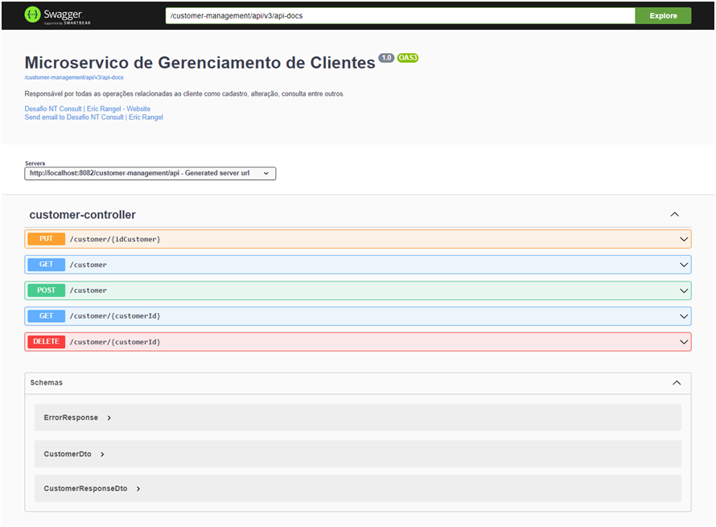
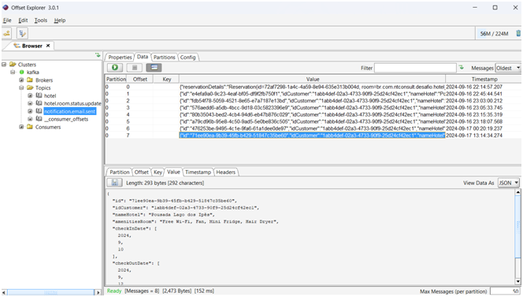
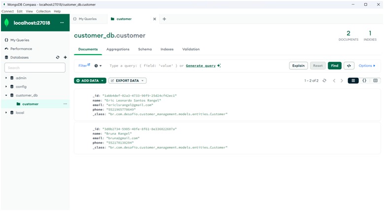
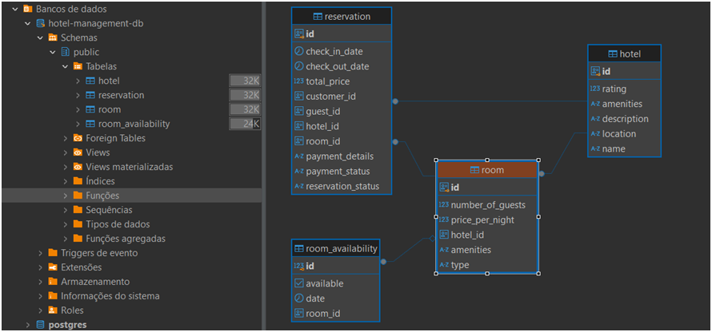
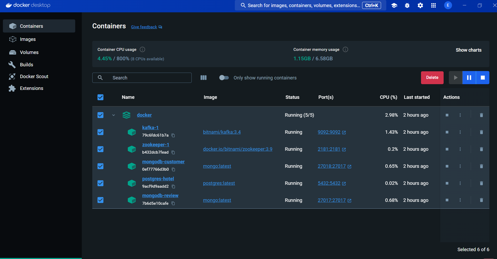

# ⭐ NT Consult  **Desafio Desenvolvedor Java**

---

## 💥 Objetivo:
- Fui desafiado a desenvolver um sistema de reserva de hotéis que deve ser altamente escalável, capaz de lidar com um grande volume de acessos simultâneos, permitindo aos usuários pesquisar, comparar e reservar quartos de hotel de forma eficiente.


## 🌐️ Meus dados:

- **Eric Leonardo S. Rangel**
    - Desenvolvedor backend - Java Pleno.
    - [Acesse meu LinkedIn](https://linkedin.com/in/ericrangelrj)
    - Email: ericlsrangel@gmail.com
    - Contato: 21 96577-0649


## 🛠️ Funcionalidades

- **Pesquisa de hotéis**
- **Comparação de Opções**
- **Reserva de Quartos**
- **Sistema de Notificações**


## 🚀 Sobre a Aplicação
- **Desenvolvida utilizando boas práticas de “Clean code”, com arquitetura em camadas (MVC) **


## 💥 Tecnologias Utilizadas
- **Spring Boot:** versão 3.3.3
- **Java:** versão 17
- **Postgres:** Banco Relacional
- **MongoDb:** Banco NoSql
- **Springdoc-openapi-Swagger:** versão 2.0.2
- **Lombok:**  versão 1.18.32
- **Apache Kafka:** Comunicação assíncrona e orientada a eventos 
- **Logback:** Utilizando servidor remoto centralizado em para todos os MSs
- **FeignClient:** Utilizado para comunicação síncrona entre os MSs
- **ModelMapper:** Facilitando a conversão de entidades em Dtos e vice versa
- **Docker:** Facilitando a construção do ambiente de desenvolvimento

## 🛠️ Ferramentas Utilizadas
- [GitHub](https://github.com/)
- [IntelliJ IDEA](https://www.jetbrains.com/idea/)
- [Postman](https://www.postman.com/)
- [Draw.io](https://app.diagrams.net/)


## 😎 Design System


## 📰 Sobre a aplicação

### Microserviço customer-service(Clientes)

- Descrição: Responsável pelas rotinas de cadastro de clientes que se hospederam em cada hotel. Conta as operações básicas (CRUD).

###  Microserviço review-service(Avaliação)

- Descrição: Responsável pela persistência das opiniões dos clientes do hotel, esse microserviço conta com um banco de dados não relacional NoSql o que mantém a velocidade para obtenção de respostas e integração com os demais.

### Microserviço hotel-service(Hotel)

  - Descrição: Microserviço central que guarda a maioria das regras de negócios solcitadas por esse desafio.

## 📋 Swagger
- Acesse as URLs abaixo com o projeto rodando e terá acesso aos 3 Swaggers como esse disponíveis na aplicação.



- http://localhost:8080/hotel-management/api/swagger-ui/index.html#/

- http://localhost:8082/customer-management/swagger-ui/index.html#
 
- http://localhost:8085/review-management/api/swagger-ui/index.html


## 📋 Mensageria (EDA)
- Utilizada para garantir a comunicação assíncrona, tolerância a falhas além de permitir o desacoplamento entre os micro serviços. Foi utilizada para preparar o envio de emails de confirmação de reservas bem como notificar o cadastro de novos hotéis para qualquer outro microserviço. O projeto desenvolvido trabalha em conjunto com o cadastro de avaliações.   




## 📋 Log Centralizado
- Utilizado para facilitar o monitoramento de todos os micrserviços que estão em execução, atende ao requisito que abrange logs e métricas em tempo real.


## 📋 Banco NoSql


## 📋 PostgreSQL Modelo Entidade Relacionamento


## 💻 Docker
- Facilitando a subida de ambientes além de possibilitar a configuração e subida rápida de 3 bancos de dados rodando concomitantemente além de toda a estrutura do Apache Kafka.



## ✅ Instruções para os testes:


## Docker Compose
- Arquivo que utilizei para a configuração dos containers, com o Docker previamente instalado em sua máquina basta baixar e rodar o arquivo utilizando o comando "docker-compose up "

```
version: '3.8'

services:

  zookeeper:
    image: docker.io/bitnami/zookeeper:3.9
    ports:
      - "2181:2181"
    environment:
      - ALLOW_ANONYMOUS_LOGIN=yes

  kafka:
    image: 'bitnami/kafka:3.4'
    ports:
      - '9092:9092'
    environment:
      - KAFKA_CFG_ZOOKEEPER_CONNECT=zookeeper:2181
      - KAFKA_CFG_ADVERTISED_LISTENERS=PLAINTEXT://localhost:9092
    depends_on:
      - zookeeper

  db-client-postgres:
    image: postgres:latest
    container_name: postgres-hotel
    environment:
      POSTGRES_USER: postgres
      POSTGRES_PASSWORD: coti
      POSTGRES_DB: hotel-management-db
    ports:
      - "5432:5432"
    volumes:
      - postgres_data:/var/lib/postgresql/data
    networks:
      - my_network

  db-review-mongodb:
    image: mongo:latest
    container_name: mongodb-review
    ports:
      - "27017:27017"
    volumes:
      - mongodb1-data:/data/db
    networks:
      - my_network

  db-customer-mongodb:
    image: mongo:latest
    container_name: mongodb-customer
    ports:
      - "27018:27017"
    volumes:
      - mongodb2-data:/data/db
    networks:
      - my_network

networks:
  broker-kafka:
    driver: bridge
  my_network:
    driver: bridge

volumes:
  postgres_data:
  mongodb1-data:
  mongodb2-data:

```

## Rodar os microserviços
- Logo após baixar do repositório, com o Maven instalado acessar o diretório do projeto e rodar o comando: "mvn spring-boot:run". Rodando pela IDE fica ainda mais simples acessando a classe principal do projeto.

## 😎 Collection para testes
- Logo após estar tudo rodando importar essas Collections no Postman. São as 3 collectios necessárias para o teste, estas já estão pré-preenchidas com os dados dos campos.
- [nt-hotel.postman_collection.zip](https://github.com/EricRangelRJ/desafio-sistema-hotelaria-springBoot/blob/main/desafio_hotelaria.postman_collection.zip?raw=true)

# 🛠️ Testes de Integração

- Devido ao tempo reduzido para entrega só foram realizados testes de Integração nos endpoints do Controlador do projeto customer-managemente como exemplo para aplicação nos demais projetos.

# 💻 Melhorias
- Configuração de um servidor de email para consumo no Kafka e disparo de mensagens;
- Cobertura integral de testes de integração e unitários;
- Adicionar aquitetura Clean para divisão completa do domínio da aplicação do restante do código
- Utilizar um serviço de mensagens para push via WhatsApp dos clientes que fizeram reservas no hotel
- Adicionar autenticação JWT entre outras....

